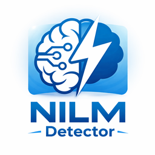

# 🏠 HA NILM Detector

<p align="center">
   
</p>

<p align="center">
  <strong>Intelligente, lokale Geräte-Erkennung aus Leistungssignalen für Home Assistant</strong><br/>
  <em>NILM = Non-Intrusive Load Monitoring – Energie-Lastaufteilung ohne separate Sensoren</em>
</p>

<p align="center">
  
   
</p>

> ⚠️ **EXPERIMENTELLES PROJEKT (BETA)**: Dieses Add-on befindet sich in aktiver Entwicklung. Viele Features funktionieren bereits gut, aber es ist **nicht production-ready**. Erwarte Bugs, unvollständige Features und Breaking Changes zwischen Versionen. Nutze es zum Experimentieren und Testen, aber nicht für kritische Automatisierungen.

<p align="center">
  <a href="#features">Features</a> •
  <a href="#quick-start">Quick Start</a> •
  <a href="#wie-es-funktioniert">Wie es funktioniert</a> •
  <a href="#konfiguration">Konfiguration</a> •
  <a href="#datenschutz">Datenschutz</a> •
  <a href="ROADMAP.md">🗺️ Roadmap</a>
</p>

---

**Aktuell:** `v0.6.29` - Update-Speed verbessert: Add-on nutzt jetzt Alpine-Binary-Pakete fuer numpy/scipy/scikit-learn statt langsamer Source-Builds.

> ℹ️ **v0.6.11 Hinweis**: Auch die oberen Dashboard-Karten (`Gesamtleistung`, `Durchschnitt`, `Messwerte`, `Gelernte Muster`) schalten jetzt sauber zwischen DE/EN um.

<a id="features"></a>
## ✨ Features

**Was funktioniert (mit Einschränkungen):**

### Core
- **🏠 100% Lokal** – Alle Daten bleiben auf deinem Home Assistant System (kein Cloud-Upload)
- **⚡ Multi-Phasen** – Nutzt L1/L2/L3 Leistungssensoren zur intelligenten Geräte-Zuweisung
- **🧠 Selbstlernend** – Passt sich an wechselnde Grundlasten an (Präzision variiert je nach Gerät)
- **📊 Live-Dashboard** – Übersicht über erkannte Geräte, Leistung und Betriebsmuster

### Pattern Learning & Recognition
- **🎯 Intelligente Mustererkennung** – Adaptive Schwellwerte mit automatischer Rauschfilterung (funktioniert gut bei stabilen Geräten wie Kühlschrank, weniger gut bei variablen Lasten)
- **📈 Power Curve Visualization** – Klick auf ein Muster zeigt die rekonstruierte Leistungskurve
- **⏰ Temporale Muster** – Lernt typische Betriebszeiten und Intervalle zwischen Zyklen
- **🔀 Multi-Modal Detection** – Unterscheidet verschiedene Betriebsmodi desselben Geräts (experimentell)
- **🏷️ Plausiblere Musterbenennung (v0.6.5+)** – Bewertet Delta zur Basis, typische Spikes und Laufzeit-Konsistenz zusätzlich
- **📉 Sichtbarer Confidence-Score (v0.6.6+)** – Zeigt pro Pattern die Erkennungssicherheit (Qualitaet + Reife)
- **🧩 Device-Gruppen (v0.6.7+)** – Mehrere Pattern desselben Geraets werden gruppiert dargestellt und gruppenbasiert vorgeschlagen
- **🔀 Besseres Mode-Clustering (v0.6.7+)** – Variable Lasten werden als Betriebsmodi in einem Pattern gebuendelt statt als viele Einzellabels
- **📐 Echte Feature-Extraction (v0.6.24)** – Edge-basierte Rise/Fall-Raten, Plateau/Substates und `step_count` statt flacher Dummy-Features
- **🧭 Deterministische Erstklassifikation (v0.6.24)** – First-Level-Regeln (`heater`, `motor`, `electronics`, `long_running`) vor ML-Fallback
- **🔁 Frequency-Refinement (v0.6.24)** – Nutzungshaeufigkeit wird in der Label-Verfeinerung beruecksichtigt, um `unknown` zu reduzieren
- **🧠 Wissensbasis-Upgrade (v0.6.26)** – Neue persistente Tabellen fuer `events`, `devices`, `classification_log`, `user_labels`, `pattern_history` und exportierbare Trainingsdaten

### Web-UI
- **🌙 Dark Mode** – Durchgehend hell/dunkel Modus mit modernem Home-Assistant-Design
- **🌍 Sprache DE/EN (v0.6.5+)** – Add-on-Option `language` und Umschalter im Dashboard
- **🔍 Schnelle Suche & Filter** – Muster nach Label, Typ, ID oder Häufigkeit durchsuchen
- **📊 Flexible Sortierung** – Nach Häufigkeit, Leistung, Dauer, Stabilität oder Zeitintervall
- **✏️ Bereich-Markierung** – Zeitraum ziehen im Chart und direkt als Muster speichern
- **📋 Detaillierte Analytics** – Häufigkeit, Betriebszeiten, typische Tageszeiten, stability scores

### Phase Detection & Learning
- **⚖️ Intelligente 3-Phasen-Erkennung** – Echte 3-Phasen-Geräte (Motor, großer Herd) vs. einzelne Geräte auf verschiedenen Phasen
- **📊 Power Distribution Ratio** – Nutzt Leistungsverteilung statt absoluter Grenzen (verhindert Fehlklassifikation)
- **🔌 Per-Phase Pattern Learning (v0.6.0+)** – Jede Phase (L1/L2/L3) trackt Muster unabhängig
- **🚫 Interferenz-Schutz** – Kühlschrank (L1, 150W) + Waschmaschine (L2, 800W) = 2 separate Patterns, nicht 950W-Gerät
- **🎯 Phase-Attribution** – UI zeigt eindeutig, auf welcher Phase ein Gerät läuft


<a id="quick-start"></a>
## 🚀 Quick Start

### Installation (Home Assistant Add-on)

1. **Repository hinzufügen:**
   - Home Assistant → Add-ons → Add-on Store (⋮ → Repositories)
   - Repository URL eingeben: `https://github.com/BlueIceWolf/ha-nilm-addon`
   - **HA NILM Detector** installieren

2. **Konfigurieren (Minimal):**
   - Add-on Optionen öffnen
   - Mindestens eine Phase eingeben (L1, L2 oder L3):
   ```yaml
   home_assistant:
     phase_entities:
       l1: sensor.dein_l1_leistung
       l2: sensor.dein_l2_leistung
       l3: sensor.dein_l3_leistung
   ```

3. **Starten:**
   - Add-on starten
   - Auf „Webseite öffnen" klicken
   - Live zu beobachten: Leistungsmessung sollte im Chart sichtbar sein

### Erste Schritte in der UI

1. **Live-Daten verstehen:**
   - Chart zeigt: Gesamtleistung + optional L1/L2/L3 einzeln
   - Status oben rechts: aktueller Zustand (Laden, aktiv, Fehler)

2. **Lernphase starten:**
   - Ein paar Minuten Geräte normal nutzen (Kühlschrank läuft, TV anschalten, etc.)
   - Auf **„Lernen jetzt ausführen"** klicken
   - Add-on analysiert die Leistungsmuster

3. **Muster korrigieren:**
   - Erkannte Muster unter „Gelernte Muster" anschauen
   - Auf **„Label"** klicken und Gerätnamen eintragen (z.B. „Kühlschrank")
   - Beim nächsten Lernen nutzt der Add-on diese Informationen

4. **Manuelles Lernen (optional):**
   - **Bereich markieren** – Im Chart einen Leistungsspitzenzeitraum ziehen
   - Label eingeben und speichern – Pattern unmittelbar verfügbar

<a id="wie-es-funktioniert"></a>
## 🔧 Wie es funktioniert

### NILM Concept
**Non-Intrusive Load Monitoring** nutzt die Gesamtleistung einer oder mehrerer Phasen, um einzelne Geräte zu identifizieren – ohne dass jedes Gerät separat gemessen werden muss.

```
Phasen-Leistungsdaten (REST API von HA)
         ↓
[Live Power Reading]
   L1: 520W, L2: 180W, L3: 10W
         ↓
[Cycle Detection] (Adaptive Schwellwerte)
   - Erkennt An/Aus Übergänge
   - Filtert Rauschen (Median)
   - Debouncing (2 Sample Bestätigung)
         ↓
[Feature Extraction]
   - Ermittelt: Peak, Duration, Shape (Rise/Fall Rate)
   - Phasen-Modi (Mono- vs. Multi-Phase)
   - Betriebsmodi
         ↓
[Pattern Matching/Learning] (Per-Phase seit v0.6.0)
   - Separate Learner für L1/L2/L3 (conditional activation)
   - Vergleicht nur mit Mustern der gleichen Phase
   - Findet beste Übereinstimmung (Distance-Metrik)
   - MATCH: Update existierendes Pattern (EMA)
   - NOMATCH: Pattern neu erstellen mit Phase-Attribution
         ↓
[Nightly Merge]
   - Ähnliche Muster zusammenfügen
   - Duplikate entfernen
   - Temporale Daten verfeinern
         ↓
[Web-UI Darstellung]
   - Erkannte Geräte, Power Curves, Statistiken
```

### Algorithms & Thresholds

| Komponente | Methode | Details |
|------------|---------|----------|
| **Cycle Detection** | Adaptive Schwellwert | ±30% von gleitendem Mittelwert |
| **Noise Filter** | Median (Window=3) | Eliminiert transiente Störungen |
| **Pattern Matching** | Multi-dimensional Distance | ~15 Features, Toleranz=0.38 (Echtzeit), 0.20 (Nacht) |
| **Pattern Learning** | Per-Phase Tracking (v0.6.0+) | Separate learners für L1/L2/L3, phase-based filtering |
| **Feature Update** | EMA (Exponential Moving Avg) | α = 1/seen_count |
| **3-Phase Detection** | Power Distribution Ratio | ALL 3 phases: min>15%, max<60% → multi_phase |

---

<a id="konfiguration"></a>
## ⚙️ Konfiguration

### Minimal (Recommended)
```yaml
home_assistant:
  phase_entities:
    l1: sensor.dein_l1_leistung
    l2: sensor.dein_l2_leistung
    l3: sensor.dein_l3_leistung
```
**Das ist alles was du brauchst!** Lernen läuft automatisch mit Defaults.

### Optional: Advanced Settings
Weitere Optionen als optionale Schema-Felder verfügbar:

```yaml
home_assistant:
  phase_entities:
    l1: sensor.dein_l1_leistung
    l2: sensor.dein_l2_leistung
    l3: sensor.dein_l3_leistung

learning:
  enabled: true
  check_interval_minutes: 30

logging:
  level: INFO
```

---

<a id="datenschutz"></a>
## 🔒 Datenschutz

- **100% Local** – Alle Daten auf deinem HA-System
- **No Cloud** – Kein Upload zu externen Servern
- **Transparent** – Open-Source Code, dokumentierte Algorithmen

**Storage:**
- Standard-Basispfad: `/data/ha_nilm_detector` (konfigurierbar via `storage.base_path`)
- Live-Daten: `/data/ha_nilm_detector/nilm_live.sqlite3` (Auto-Rotation nach 30 Tagen)
- Patterns: `/data/ha_nilm_detector/nilm_patterns.sqlite3` (Persistent)
- Log: `/data/ha_nilm_detector/nilm.log`

---

## 📊 Web-UI Guide

### Erkannte Geräte
- Status, Leistung, Konfidenz, tägl. Zyklen

### Gelernte Muster
- Klick auf Reihe → Power Curve Modal
- Zeigt: Peak, Duration, Rise/Fall Rate, Häufigkeit, Phase-Modus
- Label bearbeiten, Muster löschen

---

## 🐛 Troubleshooting

### Keine Daten im Chart
- Phase-Sensoren in Optionen gesetzt?
- Sensor in HA vorhanden? (Developer Tools → States prüfen)
- Add-on Logs checken

### Patterns werden nicht erkannt
- **2-5 Min warten** mit normaler Nutzung
- **„Lernen jetzt"** Button klicken
- Geräte mehrfach an/aus schalten

### Nach Update: Browser Hard-Reload (`Ctrl+Shift+R`)

---

## ⚠️ Known Limitations (BETA)

**Was noch nicht gut funktioniert:**
- **Variable Lasten**: Geräte mit stark schwankender Leistung (z.B. Induktionsherd, Staubsauger mit variabler Stufe) werden oft als mehrere Geräte erkannt
- **Kleine Lasten**: Geräte unter ~20W können von Grundlast-Schwankungen überdeckt werden
- **Gleichzeitige Events**: Wenn 2+ Geräte exakt gleichzeitig starten/stoppen, kann die Zuordnung fehlschlagen
- **Inverter-Geräte**: Moderne Inverter-Kompressoren (Klimaanlage, Wärmepumpe) haben komplexe Muster - Erkennung experimentell
- **MQTT Discovery**: Noch nicht implementiert (geplant für spätere Version)
- **Automatische Benachrichtigungen**: Home Assistant Notifications noch nicht integriert

**Bekannte Bugs:**
- Bei sehr schnellem Phasenwechsel kann Chart kurz "springen"
- Pattern-Merge-Funktion kann manchmal zu aggressive Duplikate entfernen
- Manual pattern creation via UI kann bei sehr langen Zeiträumen (>1h) langsam sein

**Empfohlene Geräte zum Testen:**
- ✅ Kühlschrank, Gefrierschrank (sehr stabile Patterns)
- ✅ Waschmaschine, Geschirrspüler (klare Phasen)
- ✅ Wasserkocher, Kaffeemaschine (einfache On/Off)
- ⚠️ TV, Computer (variable Leistung)
- ❌ LED-Leuchten (zu geringe Leistung)
- ❌ Photovoltaik-Wechselrichter (invers - erzeugt statt verbraucht)

---

## 📁 Project Structure

- Add-on: `ha-nilm-detector/`
- Manifest: `ha-nilm-detector/config.yaml`
- Docs: `ha-nilm-detector/DOCS.md`
- Changelog: `ha-nilm-detector/CHANGELOG.md`
- Release Notes: `ha-nilm-detector/RELEASE.md`

---

## 🤝 Contributing

Issues, feature requests und PRs sind willkommen!

**Lokale Entwicklung:**
```bash
git clone https://github.com/BlueIceWolf/ha-nilm-addon.git
cd ha-nilm-addon
python -m venv venv
source venv/bin/activate  # Windows: venv\Scripts\activate
pip install -r ha-nilm-detector/requirements.txt
```

---

## 📄 License

MIT License – siehe [LICENSE](LICENSE) Datei

---

<p align="center">
  Made with ❤️ for Home Assistant enthusiasts<br/>
  <a href="https://github.com/BlueIceWolf/ha-nilm-addon">⭐ Star us on GitHub</a>
</p>
