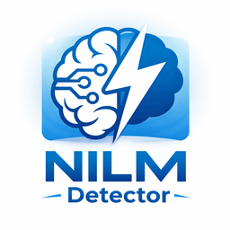

# HA NILM Detector

<p align="center">
  
</p>

<p align="center">
  <strong>Lokale Geräteerkennung aus Stromverbrauchsdaten für Home Assistant</strong><br>
  <em>NILM = Non-Intrusive Load Monitoring</em>
</p>

<p align="center">
  
  
  
  
</p>

> [!WARNING]
> HA NILM Detector ist ein experimentelles Beta-Projekt. Die Erkennung funktioniert bei klaren, wiederkehrenden Lastprofilen bereits gut, ist aber noch nicht für kritische Automatisierungen gedacht.

## Was macht das Add-on?

HA NILM Detector beobachtet einen oder mehrere Leistungssensoren aus Home Assistant und versucht daraus wiederkehrende Geräte- und Lastmuster zu erkennen.

Du brauchst dafür **keinen separaten Sensor an jedem Gerät**. Für den Einstieg reicht ein Leistungssensor auf einer Phase. Mit getrennten Sensoren für L1, L2 und L3 kann die Erkennung zusätzlich phasenbezogen arbeiten.

### Aktueller Stand in v0.6.44

- lokale Verarbeitung ohne Cloud-Zwang
- L1/L2/L3 einzeln nutzbar
- Event- und Zykluserkennung mit Pre-/Post-Roll
- per-Phase Pattern Learning
- stabile und provisorische Lernmuster
- Pattern-Matching nach Leistung, Dauer und Kurvenform
- fuzzy Merge ähnlicher Muster
- Confidence- und Segmentierungsbewertung
- Web-UI über Home Assistant Ingress
- manuelle Labels und Korrekturen
- Debug-/Training-Log
- SQLite-Persistenz
- Shared-Pattern- und LLM-Review-Exports

Die ausführlichen Änderungen stehen in [RELEASE.md](ha-nilm-detector/RELEASE.md) und [CHANGELOG.md](ha-nilm-detector/CHANGELOG.md).

## Installation

1. Öffne in Home Assistant **Einstellungen → Add-ons → Add-on Store**.
2. Öffne oben rechts das Menü **Repositories**.
3. Füge dieses Repository hinzu:

```text
https://github.com/BlueIceWolf/ha-nilm-addon
```

4. Installiere **HA NILM Detector**.
5. Trage mindestens einen Leistungssensor ein.
6. Starte das Add-on und öffne die Weboberfläche.

## Minimale Konfiguration

Mindestens eine Phase muss gesetzt sein:

```yaml
home_assistant:
  phase_entities:
    l1: sensor.dein_l1_leistung
    l2: ""
    l3: ""
```

Für drei getrennte Phasen:

```yaml
home_assistant:
  phase_entities:
    l1: sensor.leistung_l1
    l2: sensor.leistung_l2
    l3: sensor.leistung_l3
```

Der Sensorzustand muss numerisch sein und die aktuelle Leistung in Watt liefern.

> [!TIP]
> Je sauberer und häufiger der Leistungssensor aktualisiert wird, desto besser kann das Add-on Start, Ende, Inrush und Kurvenform eines Ereignisses erfassen.

## Wie funktioniert das Lernen?

Vereinfacht läuft die Verarbeitung so:

```text
Home Assistant Leistungssensoren
          ↓
      Live-Messwerte
          ↓
 Event-/Zykluserkennung
          ↓
 Segmentierungsbewertung
          ↓
 Feature Extraction
 Leistung · Dauer · Rise/Fall · Plateau · Shape
          ↓
 Klassifikation / Pattern Matching
          ↓
 provisional oder stable pattern
          ↓
 Merge / Bestätigung / Benutzerlabel
          ↓
 Web-UI + lokale Datenbank
```

Muster mit schwächerer Segmentierung können zunächst als **provisional** gesammelt werden. Wiederholt sich ein plausibles Muster oft genug, kann es zu einem stabilen Pattern hochgestuft werden.

## Welche Geräte funktionieren gut?

**Meist einfacher zu erkennen**

- Kühlschrank und Gefrierschrank
- Wasserkocher
- Kaffeemaschine
- klassische Heizlasten
- Pumpen oder Motoren mit wiederkehrendem Zyklus
- Geräte mit klarer Ein-/Aus-Leistung

**Schwieriger**

- Wärmepumpen und Klimaanlagen mit Inverter
- Induktionskochfelder
- Computer und Fernseher mit stark variabler Leistungsaufnahme
- sehr kleine Lasten
- mehrere Geräte, die nahezu gleichzeitig schalten

NILM ist keine direkte Gerätemessung. Zwei Geräte mit sehr ähnlichen Lastprofilen können deshalb verwechselt werden.

## Web-UI

Die Weboberfläche wird über Home Assistant Ingress geöffnet und trennt den Workflow in mehrere Bereiche:

- **Live** – aktuelle Leistung und Verlauf
- **Events** – erkannte Lastwechsel und Zyklen
- **Geräte** – gruppierte und erkannte Muster
- **Lernen** – Pattern-Status, Labels und Lernentscheidungen
- **Debug** – Pipeline- und Trainingsinformationen

Gelernte Muster können manuell beschriftet werden. Diese Korrekturen helfen dabei, spätere Matches nachvollziehbarer zu machen.

## Speicherorte

Standardmäßig nutzt das Add-on:

```text
/data/ha_nilm_detector/
├── nilm_live.sqlite3
├── nilm_patterns.sqlite3
└── nilm.log
```

Die Daten bleiben lokal im Add-on-Speicher. Exportfunktionen werden nur aktiv vom Benutzer ausgelöst.

## Wichtige Optionen

Für den normalen Betrieb sind die Standardwerte vorgesehen. Relevante erweiterte Optionen sind unter anderem:

```yaml
language: de
log_level: info
update_interval_seconds: 5

learning:
  auto_pipeline_enabled: true
  auto_pipeline_interval_minutes: 30
  start_threshold_w: 30
  end_threshold_w: 12
  pre_roll_s: 20
  post_roll_s: 30
  pattern_match_threshold: 0.45
  segmentation_threshold: 0.40
  stable_segmentation_threshold: 0.70

storage:
  base_path: /data/ha_nilm_detector
  retention_days: 30
```

Ändere die Lernparameter nur gezielt. Zu aggressive Schwellwerte erzeugen schnell fragmentierte oder falsche Patterns.

## Troubleshooting

### Keine Messwerte

- Entity-ID auf Tippfehler prüfen
- Sensor in **Entwicklerwerkzeuge → Zustände** kontrollieren
- sicherstellen, dass der Sensor einen numerischen Watt-Wert liefert
- Add-on-Log prüfen

### Keine Patterns

- mehrere klare Schaltvorgänge des gleichen Geräts abwarten
- unter **Events** prüfen, ob überhaupt vollständige Ereignisse erkannt werden
- bei Bedarf `log_level: debug` setzen
- Segmentierungs- und Training-Log kontrollieren

### Zu viele ähnliche Patterns

Das kann bei variablen Lasten oder unvollständig erfassten Zyklen passieren. v0.6.44 enthält bereits verbessertes fuzzy Merging und strengere Segmentierungsbewertung, trotzdem bleibt das ein aktiver Entwicklungsbereich.

### Web-UI wirkt nach Update alt

Browser einmal hart neu laden:

```text
Ctrl + Shift + R
```

## Entwicklung

Das eigentliche Home-Assistant-Add-on liegt in:

```text
ha-nilm-detector/
```

Wichtige Dateien:

```text
ha-nilm-detector/
├── app/                 Python-Anwendung
├── config.yaml          Add-on-Manifest und Optionen
├── Dockerfile
├── run.sh
├── DOCS.md              Add-on-Store-Dokumentation
├── CHANGELOG.md
└── RELEASE.md
```

Tests lokal:

```bash
python -m venv .venv
source .venv/bin/activate
pip install -r requirements.txt
pip install pytest
pytest -q
```

Unter Windows:

```powershell
.venv\Scripts\activate
```

## Projektstatus

Version **0.6.44** wurde laut Release-Dokumentation mit dem vollständigen `ha-nilm-detector`-Testlauf validiert (`35 passed`). Das Projekt bleibt trotzdem Beta, weil reale Häuser und Lastprofile deutlich vielfältiger sind als synthetische Tests.

## Mitmachen

Issues, reproduzierbare Messbeispiele und Pull Requests sind willkommen. Besonders hilfreich sind Fälle, bei denen ein Event falsch segmentiert, ein Gerät falsch klassifiziert oder ein Pattern unnötig dupliziert wird.

## Lizenz

MIT License – siehe [LICENSE](LICENSE).
